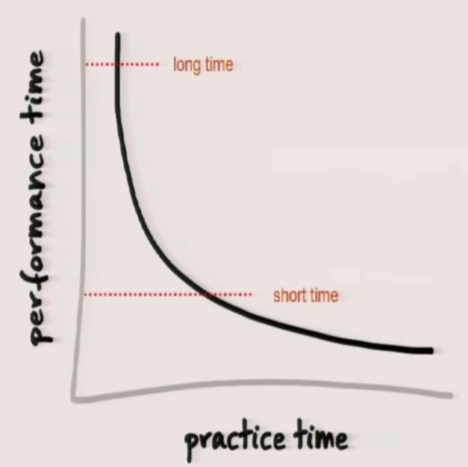
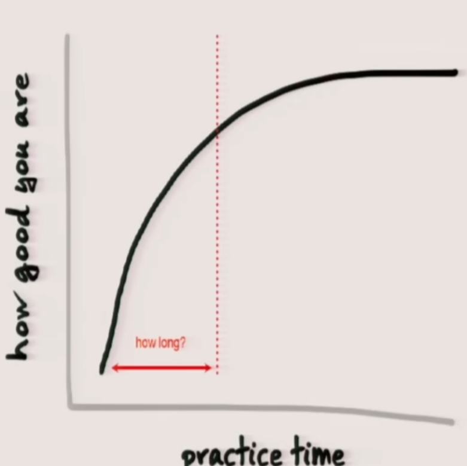

# Learning

## The $20$ hour rule

As you practice more and more, it takes you less and less time to complete a task.

Also, as you practice more and more, you get better and better at the task.

1. Deconstruct the skill. Decide exactly what you want to be able to do when you're done. Look into the skill and break it down into smaller and smaller bundles of skills. The more you can break down the skill, the easier it'd be to identify the parts/skills that will actually get you what you want (and then you'll practice those first).
2. Learn ***just enough*** to self-correct. Get $3$ to $5$ resources about what you're trying to learn. Use them as a way to self-correct ***during*** you practice. This means that you don't start practicing after going through them, but you practice and refer to them for guidance on how to solve the problems you're having.
3. Remove practice barriers. Plan your practice sessions so that they become habits.
4. Practice for at least $20$ hours (ex. $45$ minutes a day for about a month).

## Resources

- The first 20 hours -- how to learn anything | Josh Kaufman | TEDxCSU: <https://www.youtube.com/watch?v=5MgBikgcWnY>.
