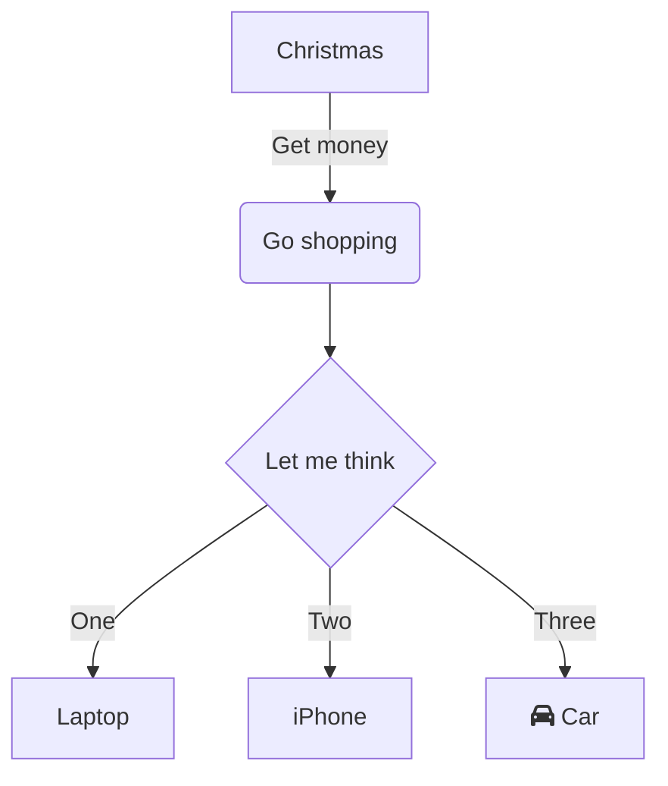
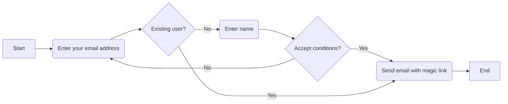
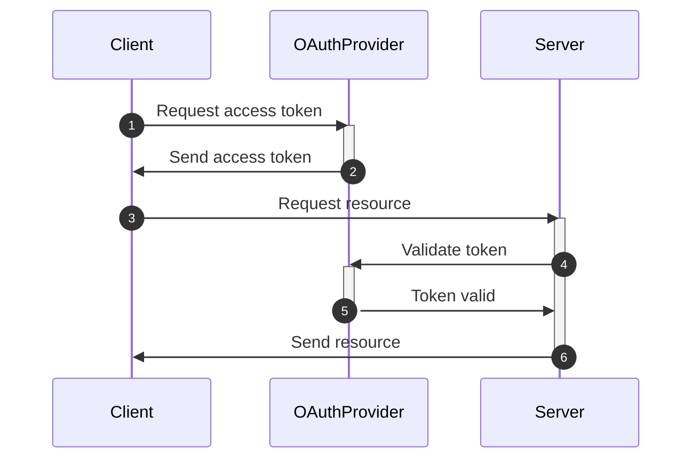
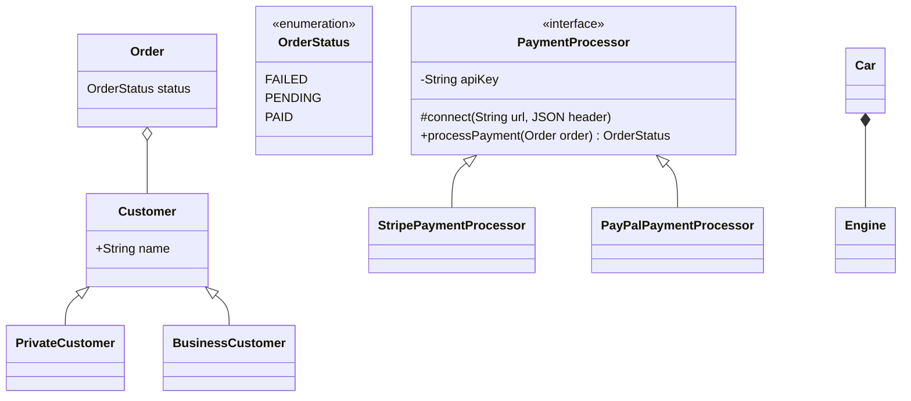
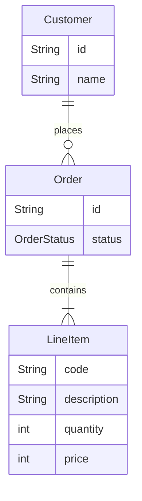
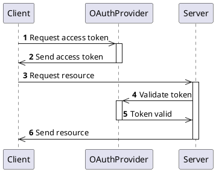

# Creating Architecture Diagrams

## Mermaid JS

### Installation

- Neovim: <https://github.com/3rd/diagram.nvim>.
- Visual Studio Code: there is an extension that renders mermaid directly in markdown (`.md`) files: [Markdown Preview Mermaid Support](https://marketplace.visualstudio.com/items?itemName=bierner.markdown-mermaid).
  - Note that there's a feature to export the diagram.
- A live web-based editor with ability to export diagrams: <https://mermaid.live>.

### Examples

#### Modelling flow

#### Modelling interaction between multiple participants

#### Modelling objects with relationships

- `o--`: Aggregation (right side can exist independently without left side).
- `*--`: Composition (right side is part of left side).
- `<|--`: Inheritance.

#### Modelling concepts

See meaning of symbols [in the Mermaid documentation](https://mermaid.js.org/syntax/entityRelationshipDiagram.html).

## Python's [`diagrams`](https://pypi.org/project/diagrams/)

- Has built-in support for cloud architectures (for example, AWS).
- Has an equivalent in Go.

## PlantUML

- More complex than mermaid.
- Oldest of all.
- To view, use [the online server](https://www.plantuml.com/plantuml/uml/SyfFKj2rKt3CoKnELR1Io4ZDoSa700002).
- Supports [JSON data visualization](https://plantuml.com/json).

## [`HackerDraw`](https://www.hackerdraw.com/) and [`ExcaliDraw`](https://excalidraw.com/)

- Newest of all.
- Purely web-based.
- Alternatives to drawio.
- Easiest to learn of all.
- Can easily integrate with Notion and Confluence.

## Resources

- Mermaid JS: Finally There's A Great UML & Diagram Drawing Tool: <https://www.youtube.com/watch?v=JiQmpA474BY>.
- Mermaid vs PlantUML vs HackerDraw: Which One Is Best For You?: <https://www.youtube.com/watch?v=tPh9_Cx4yZY>.
- Top 6 Tools to Turn Code into Beautiful Diagrams: <https://www.youtube.com/watch?v=jCd6XfWLZsg>.
